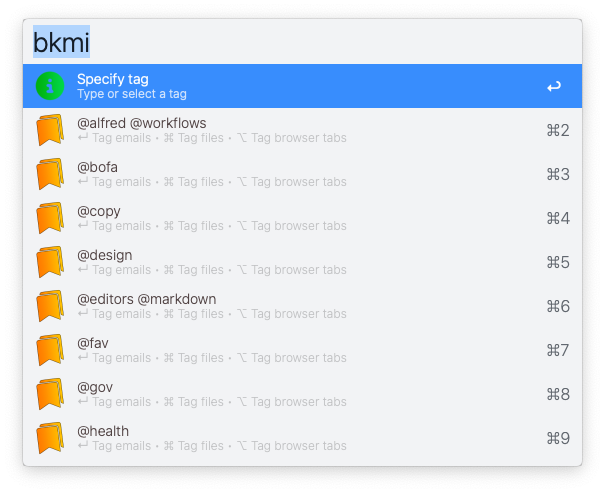
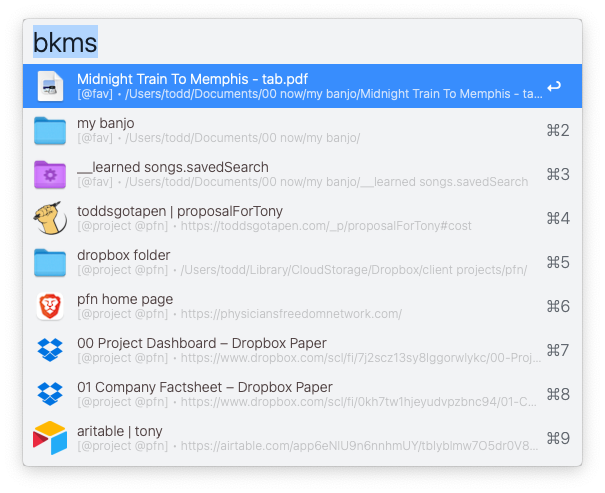
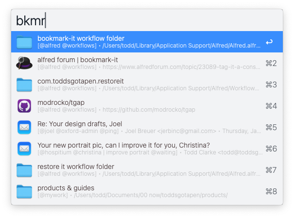

# Tag It!

Tag emails, files, folders & web pages for easy access later on. Easily manage your work projects, research, web orders, recipes... whatever. 

Works with: `Apple Mail` ∙ `Apple Finder` ∙ `Chrome, Brave, Safari, Arc & Edge Browsers`

▸ Requires [jq](https://formulae.brew.sh/formula/jq)

## Usage

### Main workflows

  

### Tag It!

To get started... tag emails, files, folders or browser tabs. Keep typing to create a new tag. Or select an existing tag.

   

<kbd>↵</kbd>  Tag all selected emails in Apple Mail window

<kbd>⌘</kbd><kbd>↵</kbd> Tag all selected files in front-most Finder window

<kbd>⌥</kbd><kbd>↵</kbd> Tag all browser tabs as per preference setting

### List tagged items

From the previous dialog... show all tags containing items for that tag.

  

<kbd>↵</kbd>  View list of item types for this tag (emails, files & tabs)

<kbd>⌘</kbd><kbd>↵</kbd> Rename this tag

<kbd>⌥</kbd><kbd>↵</kbd> Remove this tag & all its tagged items

<kbd>⌃</kbd><kbd>↵</kbd> View flat list all items for this tag

### List item types

From the previous dialog... show tagged items, grouped by item type.

  

<kbd>↵</kbd>  View items for that item type

<kbd>⌘</kbd><kbd>↵</kbd>  Tag more items of that item type

<kbd>⌥</kbd><kbd>↵</kbd>  Remove items of that item type

<kbd>⌃</kbd><kbd>↵</kbd>  Open all items of that item type

### Search tagged items

Show complete, flat list of all previously tagged items. Start typing to filter the list by title, tag, & more fields.

  

<kbd>↵</kbd>  Open the selected item

<kbd>⌘</kbd><kbd>↵</kbd> Remove the item (untag) from this tag

<kbd>⌥</kbd><kbd>↵</kbd> Rename the item (good for applying a note too)

### Show recent items

Show a list of the most recently opened items. Start typing to filter the list by title, tag, & more fields.

  

<kbd>↵</kbd>  Open the selected item

### Run a utility command

Some useful commands to do some maintenance or move around this workflow

   

Choose the command to run. 

*Note:* `Reset workflow` *will remove all data to start over.*

---

## Tips

### Domain Icons

Drop any png file into the icons folder for your tagged bookmarks — based on domain urls. 

For example,  
(1) Search the web for the Dropbox logo file  
(2) Name it `dropbox.png`  
(3) Place it in the `/icons` folder in your `workflow folder`  

All `dropbox.com` tagged urls will now display `dropbox.png` as the default icon.

### Supported Symbols

You can type simple text or symbols, and they’ll convert automatically *(for tagging and searching)*:

`!`         → ❗   Important  
`?`         → ❓   Needs clarity  
`*`         → ⭐   Starred  
`$`         → 💰   Financial  
`:chk`  → ✅   Complete  
`>`         → 📌   Follow-up  
`~`         → 🌀   In Progress

### More Configurations

Set other useful features in `Configure Workflow`.
