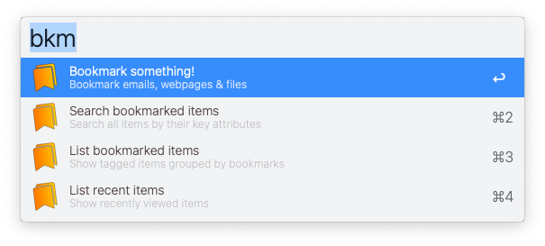

# Bookmark It!

Bookmark emails, files & web pages for easy access later on via Alfred. Easily manage your work projects, research, web orders, recipes... whatever. 

Works with: `Apple Mail` ∙ `Apple Finder` ∙ `Chrome, Brave, Safari, Arc & Edge Browsers`

▸ Requires [jq](https://formulae.brew.sh/formula/jq)

> *Check out Bookmark It!'s brother workflow, [Restore It!](https://github.com/modrocko/restore-it)*

## Usage

### Main workflows

 

###  Bookmark It!

To get started... bookmark emails, files, folders or webpages. Keep typing to create a new tag. Or select an existing tag.

    

<kbd>↵</kbd>  Tag all selected emails in Apple Mail window

<kbd>⌘</kbd><kbd>↵</kbd> Tag all selected files in front-most Finder window

<kbd>⌥</kbd><kbd>↵</kbd> Tag all browser tabs as per preference setting

### List tagged items

From the previous dialog... show all tags containing items for that tag.

   

<kbd>↵</kbd>  View list of item types for this tag (emails, files & tabs)

<kbd>⌘</kbd><kbd>↵</kbd> Rename this tag

<kbd>⌥</kbd><kbd>↵</kbd> Remove this tag & all its tagged items

<kbd>⌃</kbd><kbd>↵</kbd> View flat list all items for this tag

### List item types

From the previous dialog... show tagged items, grouped by item type.

    

<kbd>↵</kbd>  View items for that item type

<kbd>⌘</kbd><kbd>↵</kbd>  Tag more items of that item type

<kbd>⌥</kbd><kbd>↵</kbd>  Remove items of that item type

<kbd>⌃</kbd><kbd>↵</kbd>  Open all items of that item type

### Search tagged items

Show complete, flat list of all previously tagged items. Start typing to filter the list by title, tag, & more fields.

   

By default, all searches are `AND` searches — whatever you type, will show bookmarks that fulfill all of your search criteria. This feature also supports `OR` searches. Just supply `:or`at the end of your query: `bkms @wait @ping :or`

<kbd>↵</kbd>  Open the selected item

<kbd>⌘</kbd><kbd>↵</kbd> Remove the item (untag) from this tag

<kbd>⌥</kbd><kbd>↵</kbd> Rename the item (good for applying a note too)

<kbd>⌃</kbd><kbd>↵</kbd> Save this search to quickly access later

### List saved searches

List any searches saved from the dialog above.

 

<kbd>↵</kbd> Run this saved search

<kbd>⌘</kbd><kbd>↵</kbd> Remove this saved search

### Show recent items

Show a list of the most recently opened items. Start typing to filter the list by title, tag, & more fields.

  

<kbd>↵</kbd>  Open the selected item

### Run a utility command

Some useful commands to do some maintenance or move around this workflow

 

Choose the command to run. 

*Note:* `Reset workflow` *will remove all data to start over.*

---

## Tips

### Domain Icons

Drop any png file into the icons folder for your tagged bookmarks — based on domain urls. 

For example,  
(1) Search the web for the Dropbox logo file  
(2) Download & name it `dropbox.png`  
(3) Place it in the `/icons` folder in your `workflow folder`  

All `dropbox.com` tagged urls will now display `dropbox.png` as the default icon.

I provided a few starter icons for you. Then build your icon library over time.

### Tag icons

Specify these tags: `@urgent` `@waiting` `@ping` `@notes` — see icons like these for your tags & items:

 

*More icons coming...*

### Supported Symbols

See the latest symbols supported for tagging & searching items. These are great to add to your tags or items. Add more in the `Configure Workflow` section.

 

### More Configurations

Set other useful features in `Configure Workflow`.

