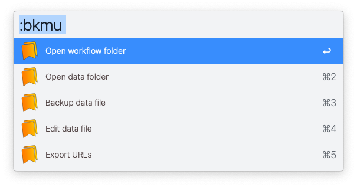

# Tag It!

Tag emails, files, folders & web pages for easy access later on.

I created this workflow to keep related items together for certain activities — all in one place. Projects, research, orders, favorites, recipes... whatever. I mainly use this for short term stuff, like the categories mentioned. But works great for long-term bookmarks too. I can tag, find & open email, files, folders & webpages — in a breeze. 

So, to summarize... a consolidated Alfred system to:  

✓  Keep your projects organized  
✓  Keep your work moving forward  
✓  Keep your brain sane

Works with: Apple Mail ∙ Apple Finder ∙ Several browsers *(excluding Firefox)*

▸ Requires [jq](https://formulae.brew.sh/formula/jq)

## Cool shit

✅ Drop any png file into the icons folder for your tagged bookmarks, based on domain urls. They'll show up as the default icon for those domains.

✅ Type '!' to mark tags or items as urgent ('❗'). Find them instantly too specifying '!'.

## Usage

Easy — just press a bunch of the option keys to start saving, finding & viewing emails, files, folders & browser tabs. 

### Main workflows

  

### Initialize workflow

▸ In *Configure Workflow*: 1) Select browser preference ∙ 2) Select tagging preference for browser window(s)

▸ Initialize the workflow to create the underlying data file *(see below)*

   

<kbd>↵</kbd>  Initialize the workflow

<kbd>⌘</kbd><kbd>↵</kbd> Reset data files (destructive action, will delete all existing data)

### Tag something

Tag emails, files, folders or browser tabs. Keep typing to create a new tag. Or select an existing tag.

   

<kbd>↵</kbd>  Tag all selected emails in Apple Mail window

<kbd>⌘</kbd><kbd>↵</kbd> Tag all selected files in front-most Finder window

<kbd>⌥</kbd><kbd>↵</kbd> Tag all browser tabs as per preference setting

### Show tagged items

From the previous dialog... show all tags containing items for that tag.

  

<kbd>↵</kbd>  View list of item types for this tag (emails, files & tabs)

<kbd>⌘</kbd><kbd>↵</kbd> Rename this tag

<kbd>⌥</kbd><kbd>↵</kbd> Remove this tag & all its tagged items

<kbd>⌃</kbd><kbd>↵</kbd> View flat list all items for this tag

### Show item types

From the previous dialog... show tagged items, grouped by item type.

  

<kbd>↵</kbd>  View items for that item type

<kbd>⌘</kbd><kbd>↵</kbd>  Tag more items of that item type

<kbd>⌥</kbd><kbd>↵</kbd>  Remove items of that item type

<kbd>⌃</kbd><kbd>↵</kbd>  Open all items of that item type

### Search tagged items

Show complete, flat list of all previously tagged items. Start typing to filter the list by title, tag, & more fields.

   

<kbd>↵</kbd>  Open the selected item

<kbd>⌘</kbd><kbd>↵</kbd> Remove the item (untag) from this tag

<kbd>⌥</kbd><kbd>↵</kbd> Rename the item (good for applying a note too)

### Show recent items

Show a list of the most recently opened items. Start typing to filter the list by title, tag, & more fields.

  

<kbd>↵</kbd>  Open the selected item
